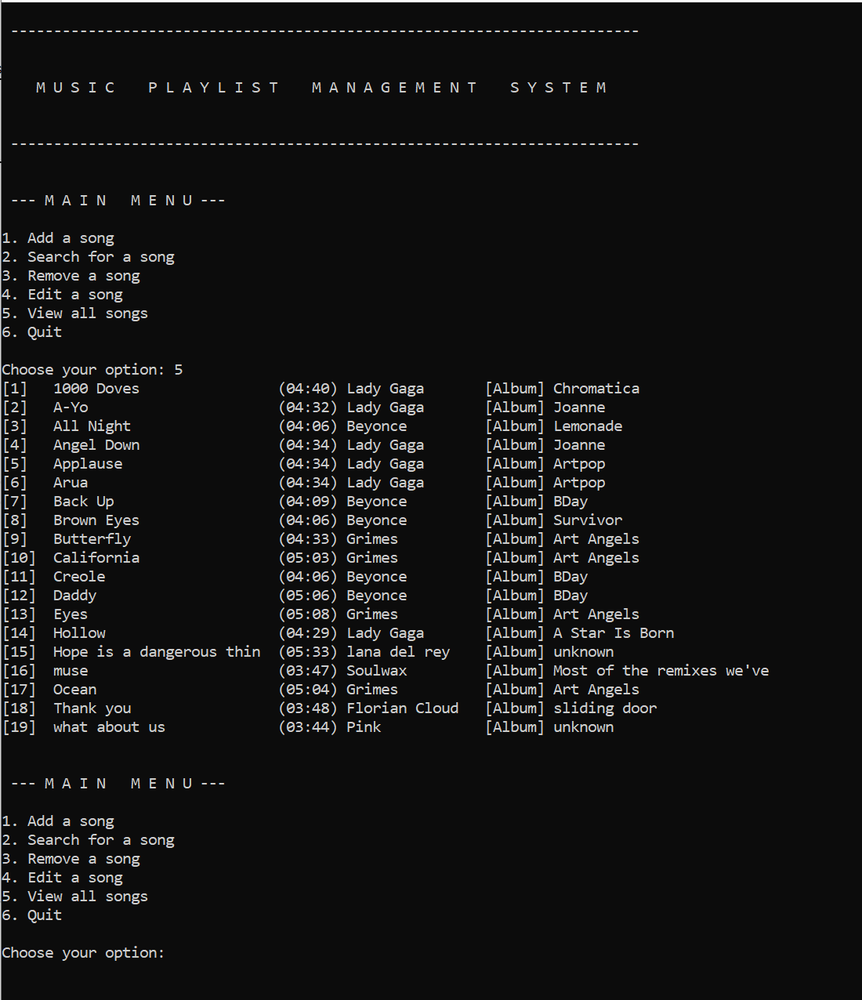

# Music Management System

* A console based application to keep track of a collection of songs. Users can view, add, remove, edit, and search for songs.
* Implemented I/O methods to read from and write to the same external file.
* Data are sorted and stored in a doubly linked list
* All objects are created dynamically on the heap. Tested to ensure memory-leak-free using Valgrind.

